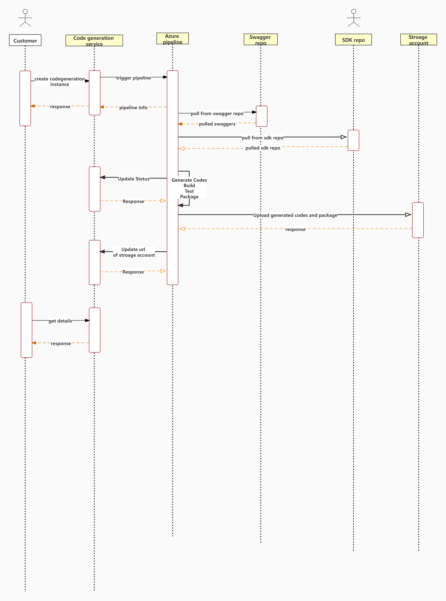
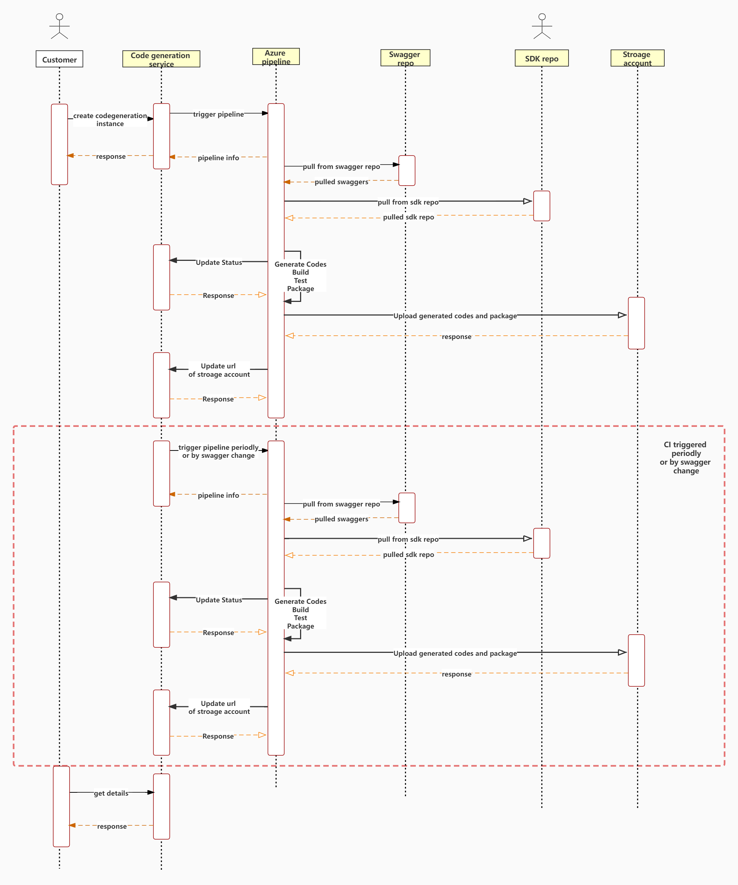
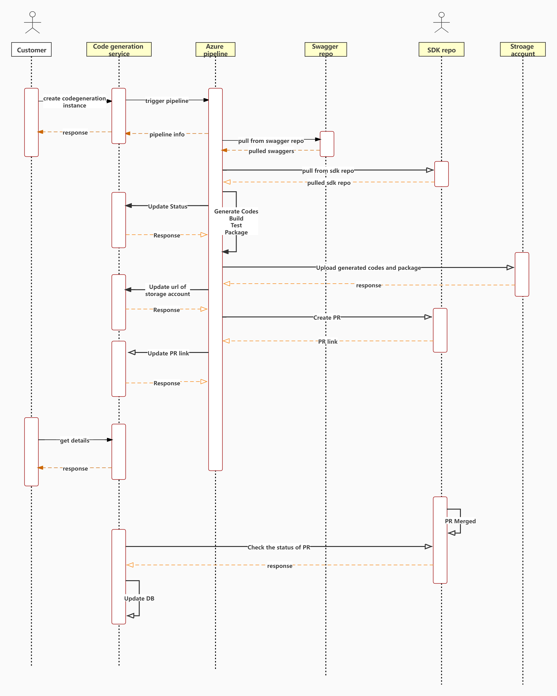

# SDK Generation Document

This document targets on describing the workflow and designs of sdk generation pipeline.

## SDK Generation Work Flow

The pipeline can run in 3 kinds of ways: ad-hoc, CI and release.

### ad-hoc
ad-hoc means running the sdk generation pipeline in one time. The pipeline generates codes, builds the generated codes, run tests and upload the generated codes and package to storage account, which can be viewed by customer.

The following is the workflow:


### CI
CI means the pipeline runs periodly and can be triggered by swagger changes. Customer can use it check the generated codes periodly.

The following is the workflow:


### Release
Release means customer has finished the swagger change and the generated codes are ready for creating a PR to sdk repository.

The following is the workflow:


## Code Generate Service
In the above workflows, we can find the customer mainly interact with code generate service. To dive into the rest apis provided by service, please go to [swagger](swaggers/v1/sdk-generation-service.yaml).

## DataBase
Code Generate Service store the information of sdk generation in MongoDB, and there are two collections: codeGenerations and sdkGenerationResults.

### sdkGenerations
Collection codeGenerations stores the information of codeGeneration instance, and the schema is following:

```typescript
export class SdkGeneration {
    name: string;
    triggerType: string;
    codeGenerationInfo: {
        resourceProvider: string;
        serviceType: string;
        resourcesToGenerate: string;
        tag: string;
        sdkName: string;
    };
    pipelineInfo: {
        pipelineRepo: RepoInfo;
        ignoreFailures: string[];
        stages: string[];
        lastPipelineBuildID: string;
        status: string;
    };
    swaggerInfo: {
        swaggerRepo: RepoInfo;
        swaggerPR: string;
    };
    sdkInfo: {
        sdkRepo: RepoInfo;
        sdkPR: string;
    };
    owners: string[];
}
export interface RepoInfo {
    type: string;
    path: string;
    branch: string;
}
```

### sdkGenerationResults
Collection sdkGenerationResults stores the task results of pipeline, and the schema is following:

```typescript
export class TaskResult {
    key: string;
    pipelineBuildId: string;
    taskResult: SdkGenerationPipelineTaskResult;
}

export type SdkGenerationPipelineTaskResult =
    | SdkGenerationPipelineTaskResultCommon
    | SdkGenerationCodeGenerateTaskResult
    | TestTaskResult;

export type SdkGenerationPipelineTaskResultCommon = {
    name: string;
    pipelineId: string;
    subTaskKey?: string;
    env?: string;
    suppressed?: boolean;
    subTitle?: string;
    parentName?: string;
    status?: PipelineStatus;
    result?: PipelineResult;
    errorCount?: number;
    warningCount?: number;
    checkRunId: number;
    checkRunUrl: string;
    checkState?: string;
    azurePipelineUrl?: string;
    pipelineJobId?: string;
    pipelineTaskId?: string;
    queuedAt: Date;
    inProgressAt?: Date;
    completedAt?: Date;
    labels?: string[];
    logUrl?: string;
    messages?: MessageRecord[];
};

export type SdkGenerationCodeGenerateTaskResult = SdkGenerationPipelineTaskResultCommon & {
    codeUrl?: string;
};

export type TestTaskResult = SdkGenerationPipelineTaskResultCommon & {
    apiCoverage?: number;
    codeCoverage?: number;
};
```
x
